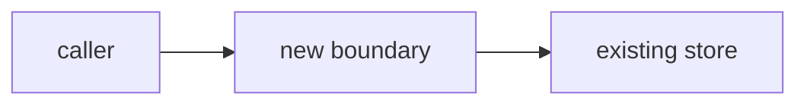

# Make PR Easy to Review

Prepare a PR so a reviewer can quickly understand the intent, important files, and risk. The default goal is reviewability without behavior changes.

## Workflow

1. Resolve the target PR from the user-provided URL or current branch.
2. Inspect commits, diff size, changed paths, generated files, and PR description.
3. Identify reviewability issues: noisy commits, stale description, unrelated changes, mixed mechanical and logic changes, missing tests, or unclear reviewer entry points.
4. Propose a plan before rewriting history or force-pushing.
5. Apply safe improvements, then verify the tree or diff still matches the intended code.

## History Cleanup

Only rewrite history when the user asks for it or agrees to the plan. Before rewriting:

```bash
gh pr view <PR> --json title,headRefName,baseRefName,state,commits
git fetch origin <headRefName> <baseRefName>
ORIGINAL_TREE=$(git rev-parse origin/<headRefName>^{tree})
```

Good commit groupings usually follow dependency order:

1. Schema/storage or generated API definitions.
2. Core logic.
3. Wiring and integration.
4. UI or surface behavior.
5. Tests.

After rewriting, verify content identity:

```bash
echo "Original tree: $ORIGINAL_TREE"
echo "Current tree:  $(git rev-parse HEAD^{tree})"
git diff origin/<headRefName> --stat
```

Do not push if the tree changed unintentionally.

## Reviewer Guidance

When code behavior should stay untouched, prefer PR description and review notes:

- Add a TL;DR that matches the actual diff.
- Separate core files from generated or mechanical files.
- Call out risky behavior changes, migration order, rollout plan, and test coverage.
- Link issue trackers, dashboards, or design docs when they explain intent.

## Explain a big or technical PR with a diagram, in the body

**`hooks/pr-explain-nudge.sh` enforces this, not this skill.** This skill does not always run, so a
trigger living only here would be dead guidance. The hook fires on `gh pr create` and on `gh pr edit
--body`, and pauses with a confirmable "ask". It stays silent once the body carries a mermaid block, so
it never asks twice. This section is the reference the hook points at.

Add a "How this works" section when the diff is **both** big and structural. Two gates, and both must
pass, or a third of all PRs would qualify:

**Size** — either 10 or more changed files, or 600 or more changed lines. Measured over the 30 most
recent merged PRs here: the median is 7 files and 304 lines, and those thresholds are the 75th
percentile.

**Shape** — the diff does at least one of these:

- Introduces a module, service, or process boundary
- Changes control flow, a state machine, or an event or job sequence
- Changes a schema, a migration, or a data contract
- Changes concurrency, ordering, retries, or a timeout
- Changes a public API or an exported type

Mechanical diffs fail the second gate however large they are. A 900-line rename needs a sentence, not
a diagram.

### Put it in the PR body, not behind a link

GitHub renders mermaid in pull request descriptions — confirmed in GitHub's own docs, which list
issues, discussions, pull requests, wikis, and Markdown files. That beats any hosted page: the
reviewer needs no account, no sharing step, and the explanation is versioned with the PR and cannot
rot.

Pick the diagram from the change, and use exactly one:

| the change is | use |
|---|---|
| A new boundary or a dependency change | `flowchart LR` of the components |
| A request, job, or event path | `sequenceDiagram` across the participants |
| A state machine or a status field | `stateDiagram-v2` |
| A schema or model change | a before-and-after table, not a diagram |

Template:

````markdown
## How this works



| read this first | why |
|---|---|
| `path/to/entry.ts` | The new boundary. Everything else follows from it |
| `path/to/migration.sql` | Runs before deploy; not reversible |

**Risk** — one sentence naming what breaks if this is wrong.
````

Keep the diagram under about 12 nodes. Past that it stops being an orientation aid, which means the
PR should be split instead.

### When an HTML artifact earns its place

Only when a page genuinely beats a diagram — several interacting flows, a decision record with
alternatives, or measurements a reviewer should sort and compare. Then publish an `Artifact` and link
it **in addition to** the in-body diagram, never instead of it.

Say this to the user before linking one, because it is their call and not a formatting detail:

- An artifact is **private by default**. A reviewer who opens the URL sees nothing until you share it.
- Sharing a work PR's internals publishes them to claude.ai. It only reaches reviewers who are in the
  same Claude organisation.

So the in-body diagram is what the reviewer is guaranteed to see. The artifact is a bonus for the
author and for anyone who can open it.

### Do not

- Commit an HTML file to the repo to explain a PR. The PR body is the place.
- Duplicate `ce-demo-reel`. Visible behaviour gets a recording; architecture gets a diagram. A PR that
  changes both gets both.
- Draw a diagram of the diff. Diagram the system the diff produces.

## Guardrails

- Never hide meaningful behavior changes inside "cleanup".
- Do not bypass hooks unless the user explicitly asks.
- If the PR is too large to make reviewable with notes, recommend splitting instead of polishing around the problem.
